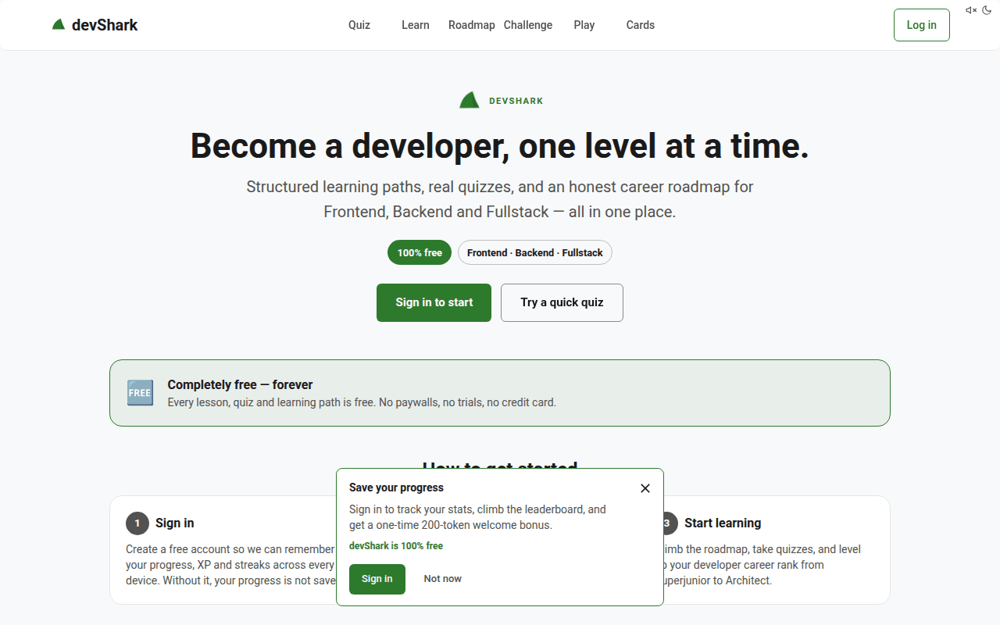

# Lukas Kouril portfolio

A bilingual portfolio for a senior software engineer. It presents selected production work, the reasoning behind key technical decisions, a complete career timeline, and a practical approach to dependable web products.

**Production:** [lukaskouril.dev](https://lukaskouril.dev)

**Languages:** English and Czech

**Deployment:** Vercel from `main`



## What the app includes

- Localized homepages at `/en` and `/cs`, with a permanent redirect from `/` to `/en`
- Three statically generated case studies for banking modernization, Ersilia AI tooling, and devShark
- Selected Work, Experience, Engineering Approach, Additional Work, Capabilities, Education, and Contact sections
- A complete eight-role career timeline and twelve-project work inventory
- Locale-aware navigation that preserves the current page when switching languages
- Localized metadata, canonical URLs, language alternates, Open Graph images, JSON-LD, sitemap, robots, privacy pages, and not-found pages
- A professional CV download with a stable public filename
- Consent-gated PostHog analytics that remains completely absent when no key is configured
- A development-only `/dev` editor for changing either locale, replacing images, and saving validated JSON content
- Automated content, security, routing, responsive, and accessibility checks

## Technology

| Area | Stack |
| --- | --- |
| Application | Next.js 15.5, React 19.1, TypeScript 6 |
| Styling and UI | Tailwind CSS 4, Radix Slot, CVA, Lucide, Geist |
| Content | Local JSON, Zod 4 schema validation, locale parity checks |
| Images | `next/image`, Sharp 0.35 upload decoding and normalization |
| Analytics | Optional PostHog EU ingestion with explicit consent |
| Testing | Vitest 4, Playwright 1.61, axe-core |
| Delivery | GitHub Actions, Vercel, Node.js 22 |

The project has no database, remote CMS, authentication service, or runtime content API. Public portfolio content is rendered from validated local files.

## Architecture

```text
English + Czech JSON content
            |
            v
Shared Zod schema + structural parity validation
            |
            v
Static locale-aware Next.js routes
            |-- /en and /cs homepages
            |-- three case studies per locale
            |-- privacy and not-found pages
            `-- metadata, JSON-LD, sitemap and robots

Local /dev editor
            |
            v
Development-only Node.js APIs
            |-- schema-validated atomic JSON writes
            `-- decoded and normalized raster-image uploads
```

Homepage and case-study content is rendered in server components. Client components are limited to navigation state, language switching, analytics consent, and the local editor.

## Local development

Node.js 22.13 or newer is required and used in CI.

```bash
npm ci
npm run dev
```

Open:

- `http://localhost:3000/en`
- `http://localhost:3000/cs`
- `http://localhost:3000/dev` for the local content editor

The editor exposes every field in the current English and Czech content documents. Image fields accept PNG, JPEG, or WebP files and store normalized WebP output under `public/`.

## Content workflow

Localized content lives in:

- `src/content/site-content.json`
- `src/content/site-content.cs.json`

Both documents use the schema in `src/lib/content-schema.ts`. Stable IDs and case-study slugs must match across languages. The validator checks schema compliance, unique IDs and slugs, flagship case-study structure, and locale parity.

Use `/dev` for normal copy and image changes. The advanced JSON panel remains available for structural edits. Structural changes must be made in both locales before either document can be saved.

## Quality commands

```bash
npm run validate:content
npm run lint
npm run typecheck
npm run test
npm run build
npm run test:e2e
npm run test:a11y
```

Install the Playwright browser once before running browser tests locally:

```bash
npx playwright install chromium
```

GitHub Actions runs content validation, linting, type checking, unit tests, a production build, route tests, mobile navigation checks, and axe accessibility checks for pull requests and `main`.

## Development editor security

- `/dev` and both editor APIs return `404` outside development.
- Content requests are size-capped and validated before writing.
- English and Czech structural parity is checked before every save.
- JSON updates use a temporary file and atomic replacement.
- Upload destinations use a fixed allowlist under `public/`.
- Uploads are capped at 5 MB and 8,000 pixels per dimension.
- Only decoded PNG, JPEG, and WebP files are accepted. SVG and GIF are rejected.
- Sharp re-encodes output to WebP, normalizes orientation, and removes metadata.
- Randomized filenames avoid predictable overwrites.

This is intentionally a local content workflow. It is not a public CMS and should never receive a production bypass.

## Accessibility and performance

The implementation targets WCAG 2.2 AA without claiming legal certification. It includes semantic landmarks and headings, a skip link, visible focus, keyboard-accessible navigation, localized alt text, 44 px minimum interactive targets, reduced-motion behavior, and reflow support at 320 CSS pixels.

Documented production budgets are:

- Lighthouse Performance: 95 or higher
- Lighthouse Accessibility: 100 in automated runs
- Lighthouse Best Practices: 100
- Lighthouse SEO: 100
- LCP: 2.5 seconds or lower
- CLS: 0.1 or lower
- INP: 200 milliseconds or lower

These are release budgets, not unmeasured claims. The repository includes automated axe coverage, while keyboard, zoom, PDF, and deployed Lighthouse checks remain manual release steps.

## Analytics and privacy

PostHog is optional. Without `NEXT_PUBLIC_POSTHOG_KEY`, no consent interface, analytics script, or analytics request is rendered.

When configured:

- the script loads only after explicit consent;
- Do Not Track disables collection;
- autocapture, form capture, session recording, and person profiles stay disabled;
- only page views and deliberate portfolio link actions are collected;
- visitors can change their preference from the footer;
- localized details are available at `/en/privacy` and `/cs/privacy`.

Copy `.env.example` to `.env.local` only when analytics testing is needed.

| Variable | Purpose |
| --- | --- |
| `NEXT_PUBLIC_POSTHOG_KEY` | Optional PostHog project key |
| `NEXT_PUBLIC_POSTHOG_HOST` | EU ingest host, defaulting to `https://eu.i.posthog.com` |

## Deployment and operating cost

The site deploys to Vercel from `main` and uses `https://lukaskouril.dev` as its canonical domain. Public pages are statically generated; `/dev` and its APIs are unavailable in production.

See [stack-and-scaling.md](stack-and-scaling.md) for the current cost estimate, platform limits, growth scenarios, and upgrade triggers. Account-specific actions and content approvals are tracked in [NEEDED.md](NEEDED.md).

## Project documentation

- [Product and design direction](docs/portfolio-direction.md)
- [Design system](docs/design-system.md)
- [Design-reference research](docs/reference-research.md)
- [Deferred media slots](docs/deferred-media.md)
- [Agent operating guide](AGENTS.md)
- [Claude project control](CLAUDE.md)
- [Content gaps](docs/content-gaps.md)
- [Manual follow-ups](docs/manual-follow-ups.md)
- [Profile synchronization](docs/profile-sync-checklist.md)
- [Manual accessibility checks](docs/accessibility-checklist.md)
- [Stack, costs, and scaling](stack-and-scaling.md)

## License

No open-source license is granted. All rights reserved.
